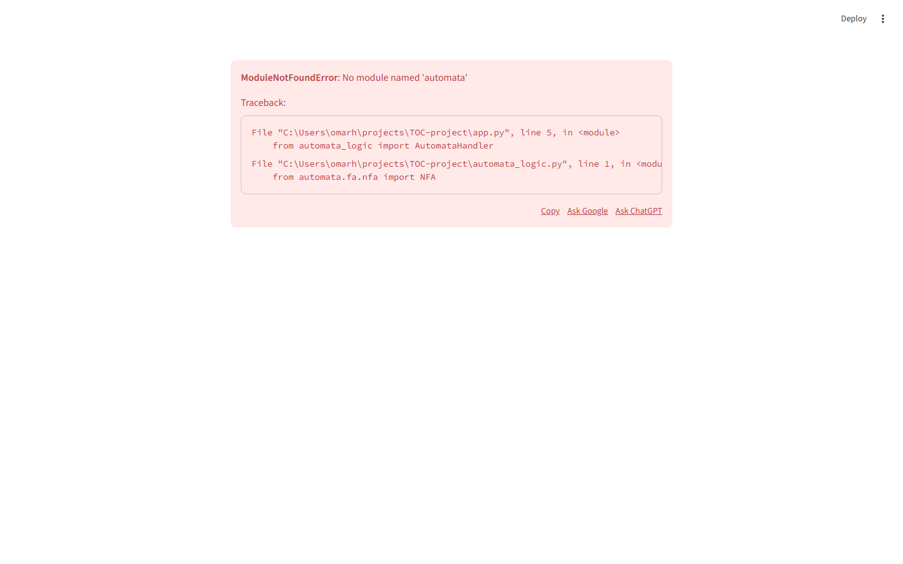

<div align="center">

# 🤖 AutomataStudio

### *AI-Powered Theory of Computation Explorer*

[](https://www.python.org/)
[](https://streamlit.io/)
[](https://deepmind.google/technologies/gemini/)
[](LICENSE)
[](https://graphviz.org/)

> **Define automata in plain English. Visualize state machines. Run formal algorithms — all in your browser.**

[](https://toc-project-c3i3gd6gbc4lk4xjgqviu9.streamlit.app/)

</div>

---

## 📖 About

**AutomataStudio** is an interactive, AI-powered web application for exploring and learning key concepts in the **Theory of Computation** — built with Python and Streamlit. It bridges the gap between natural language and formal automata theory by leveraging **Google Gemini AI** to convert plain-English language descriptions into regular expressions, which are then compiled into fully simulated DFAs and NFAs.

Whether you're a student trying to understand ε-closure or Subset Construction, or an instructor looking for a visual teaching tool, AutomataStudio provides instant visual feedback through **Graphviz state diagrams**, **transition tables**, and **step-by-step algorithm logs**. The app implements canonical theoretical algorithms — including **Moore's Minimization** and **NFA→DFA Subset Construction** — from scratch, without black-boxing the theory.

Developed as a course project for the **Theory of Computation** course at the **Arab Academy for Science, Technology & Maritime Transport (AAST)**.

---

## 🖼️ Screenshots

<div align="center">

| Main Interface | Automata Studio — State Diagram |
|:-:|:-:|
|  |  |

> *Screenshots coming soon — deploy the app locally or via Streamlit Cloud to preview.*

</div>

---

## ✨ Features

| Feature | Description |
|:---|:---|
| 🧠 **AI Language Input** | Describe a language in plain English (e.g., *"strings ending in 101"*) — Gemini converts it to a regex automatically |
| ✅ **Batch String Testing** | Test multiple strings against a defined language at once, with color-coded accept/reject results |
| 🏗️ **Manual Automaton Builder** | Define DFA or NFA state by state — transitions, start state, accept states |
| 📊 **Visual State Diagrams** | Graphviz-rendered diagrams with double-circle accept states and labeled transitions |
| 🔄 **NFA → DFA Conversion** | Full Subset Construction algorithm with human-readable subset state labels (e.g., `{q0, q1}`) |
| ⚡ **Regex → DFA Pipeline** | Chain Regex → NFA → DFA in a single operation |
| 🗜️ **DFA Minimization** | Moore's Algorithm with k-equivalence partition tables shown step by step |
| 📋 **Transition Tables** | Tabular view of every automaton's transition function via Pandas |
| 📝 **Step-by-Step Logs** | Each algorithm emits a detailed human-readable log of every computation step |
| 💡 **Context-Aware Examples** | Load relevant example automata with one click based on current context |
| 🔑 **Flexible API Key Config** | Set your Gemini key via Streamlit secrets or enter it live in the sidebar |

---

## 🧮 Supported Operations & Theory

### 1. NFA → DFA (Subset Construction)

The **Subset Construction** algorithm converts a nondeterministic finite automaton (NFA) to an equivalent deterministic finite automaton (DFA). AutomataStudio's implementation:

- Computes **ε-closures** for all state sets
- Names resulting DFA states using their NFA subset labels (e.g., `{q0, q1, q2}`) for full traceability
- Marks any DFA state as accepting if it contains at least one NFA accept state
- Emits a **step-by-step log** of the worklist algorithm

```
δ'(Q, a) = ε-closure( ∪ δ(q, a) for q ∈ Q )
```

### 2. DFA Minimization (Moore's Algorithm)

The **Moore's Algorithm** partitions states into equivalence classes based on their distinguishability:

- **Step 0:** Split states into accepting (F) and non-accepting (Q \ F)
- **Step k:** Refine partitions — two states are k-equivalent if all transitions lead to the same (k−1)-equivalence class
- Terminates when no partition can be further split
- Displays each **k-equivalence partition table** in the UI

```
[p] ≡ₖ [q]  iff  ∀a ∈ Σ: [δ(p,a)] ≡ₖ₋₁ [δ(q,a)]
```

### 3. Regex → NFA → DFA Pipeline

Converts a regular expression into a DFA through Thompson's construction (via `automata-lib`), followed by Subset Construction — displayed as a fully labeled Graphviz diagram.

### 4. ε-Closure Computation

Computes the set of all states reachable from a given state via ε-transitions alone — used internally by NFA→DFA conversion and displayed in operation logs.

---

## 🛠️ Tech Stack

| Layer | Technology | Purpose |
|:---|:---|:---|
| **UI Framework** | [Streamlit](https://streamlit.io/) | Web interface, tab layout, session state management |
| **Language** | Python 3.8+ | Core application logic |
| **Automata Engine** | [automata-lib](https://github.com/caleb531/automata) | DFA/NFA data structures and simulation |
| **AI Integration** | [Google Gemini API](https://ai.google.dev/) | Natural language → Regular expression conversion |
| **Graph Rendering** | [Graphviz](https://graphviz.org/) | State diagram visualization |
| **Data Display** | [Pandas](https://pandas.pydata.org/) | Transition tables and batch test result grids |

---

## 🚀 Quick Start

### Prerequisites

- Python **3.8 or higher**
- [Graphviz](https://graphviz.org/download/) installed and on your system `PATH`
- A **Google Gemini API key** (free tier available at [Google AI Studio](https://aistudio.google.com/))

### 1. Clone the Repository

```bash
git clone https://github.com/4awmy/AutomataStudio.git
cd AutomataStudio
```

### 2. Create a Virtual Environment

```bash
python -m venv venv

# Windows
venv\Scripts\activate

# macOS / Linux
source venv/bin/activate
```

### 3. Install Dependencies

```bash
pip install -r requirements.txt
```

### 4. Configure Your API Key

See the [API Key Configuration](#-api-key-configuration) section below.

### 5. Launch the App

```bash
streamlit run app.py
```

The app will open automatically at `http://localhost:8501`.

---

## 🔑 API Key Configuration

AutomataStudio uses a **priority system** for the Gemini API key:

### Option A — Streamlit Secrets (Recommended for Deployment)

Create the file `.streamlit/secrets.toml` in the project root:

```toml
# .streamlit/secrets.toml
GOOGLE_API_KEY = "your_gemini_api_key_here"
```

> ⚠️ **Never commit this file to version control.** It is already listed in `.gitignore`.

### Option B — Runtime Sidebar Entry

If no secret is configured, AutomataStudio will display an API key input field in the **sidebar** when the app launches. Enter your key there — it is stored only in Streamlit session state and never persisted to disk.

### Getting a Free API Key

1. Visit [Google AI Studio](https://aistudio.google.com/)
2. Sign in with your Google account
3. Click **"Get API Key"** → **"Create API key"**
4. Copy the key and use it with either option above

---

## 📁 Project Structure

```
AutomataStudio/
│
├── app.py                  # Main Streamlit application — tab layout, session state, sidebar
├── automata_logic.py       # Core algorithm implementations
│   │                         (nfa_to_dfa, minimize_dfa_with_steps,
│   │                          regex_to_dfa, get_graphviz_source)
├── ai_handler.py           # Google Gemini API integration
│   │                         (dynamic model resolution, structured outputs)
├── logic.py                # LanguageProcessor orchestration class
├── main.py                 # Legacy CLI interface
│
├── requirements.txt        # Python dependencies
│
├── .streamlit/
│   └── secrets.toml        # API key (local only, git-ignored)
│
└── docs/
    └── screenshots/        # Application screenshots
        └── automatastudio_main.png
```

---

## 📦 Dependencies

```txt
streamlit
automata-lib
google-generativeai
graphviz
pandas
```

Install all at once:

```bash
pip install -r requirements.txt
```

> **Note:** `graphviz` (the Python package) requires the [Graphviz system binaries](https://graphviz.org/download/) to be installed separately. On Windows, ensure the `bin/` folder is added to your `PATH` environment variable.

---

## 🎓 Course Context

This project was developed as part of the **Theory of Computation** course at:

> **Arab Academy for Science, Technology & Maritime Transport (AAST)**

The algorithms implemented — Subset Construction, Moore's Minimization, ε-closure — directly correspond to topics covered in standard Theory of Computation curricula based on Sipser's *"Introduction to the Theory of Computation"*.

---

## 👤 Author

<div align="center">

**Omar Hossam**

[](https://github.com/4awmy)

*Computer Science Student — Arab Academy for Science, Technology & Maritime Transport*

</div>

---

## 📄 License

This project is licensed under the **MIT License** — see the [LICENSE](LICENSE) file for details.

```
MIT License

Copyright (c) 2024 Omar Hossam

Permission is hereby granted, free of charge, to any person obtaining a copy
of this software and associated documentation files (the "Software"), to deal
in the Software without restriction, including without limitation the rights
to use, copy, modify, merge, publish, distribute, sublicense, and/or sell
copies of the Software, and to permit persons to whom the Software is
furnished to do so, subject to the following conditions:

The above copyright notice and this permission notice shall be included in all
copies or substantial portions of the Software.

THE SOFTWARE IS PROVIDED "AS IS", WITHOUT WARRANTY OF ANY KIND, EXPRESS OR
IMPLIED, INCLUDING BUT NOT LIMITED TO THE WARRANTIES OF MERCHANTABILITY,
FITNESS FOR A PARTICULAR PURPOSE AND NONINFRINGEMENT.
```

---

<div align="center">

Made with ❤️ and a lot of state transitions

⭐ **Star this repo if AutomataStudio helped you understand automata theory!** ⭐

</div>
